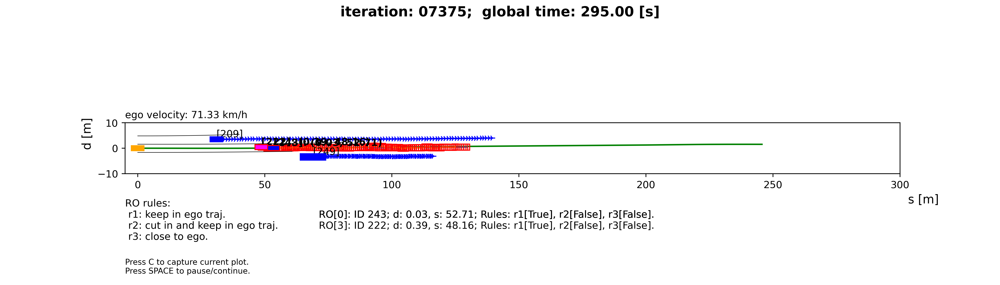
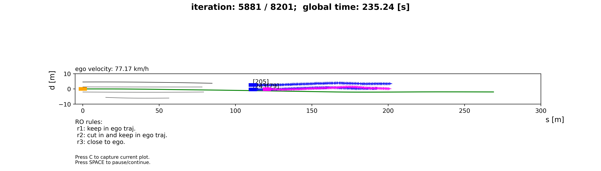

# Related Object Detection

## Display
<div align="center">
  <br>  
  <br>  
  Display with matplotlib<br>
</div> 

- press `SPACE` to pause the plotting
- press `c` to capture a snapshot, save to /snapshots
- press `ESC` to exit
  
### Legend
| Marker | stands for ... |
| --- | --- |
| **Orange rect** | Ego car |
| **Green line** | Ego traj |
| **Black line** | lane and road structure |
| **Red** | RO and RO traj |
| **Blue** | Actor vehicles & trajs detected from Camera (BV2) |
| **Pink** | Actor vehicles & trajs detected from Long-range Radar (LRR1) |

<br>  
<br>  

# Setup & Run
- create an conda env `ro_viz` and activate it:
    ```bash
    conda create --name ro_viz python=3.9.16
    conda activate ro_viz
    ```
- cd to the project's root folder (where this README exists), install the package in requirements.txt
    ```bash
    pip install -r requirements.txt
    ```
- create folder `/data` in root path (as defined in default args), place the `.mat` recordings in `/data`.
  - There is already one `.mat` recording provided in the folder to run demo

    > Place ONLY ONE `.mat` recording in the `/data` folder every time.
<!-- 
    <details>
    <summary>convert .dat recordings to .mat</summary>

    - use Cisco to connect remote discs (Intranet)  
    visit the remote disk `M:\ADA\Highway-Pilot-Supervisor\ADTF_Recording`, select a `.dat` file in it.
    - visit the gitlab repo [group-mdm-tools](https://cicd.skyway.porsche.com/hwpt/group-mdm-tools), clone to local machine.  
    - check [README](https://cicd.skyway.porsche.com/hwpt/group-mdm-tools/-/blob/development/dat-reader-tool/readme.md) in `\group-mdm-tools\dat-reader-tool\`, line 14:  
      run this command at the path `\group-mdm-tools\dat-reader-tool\` (for every dat file you need to export):
      ```
      java -jar dat-reader-tool-assembly-0.0.1.jar <path_to_dat_file>  <path_to_fibex_file> <output_path> <delete_processed_data_flag>
      ```
      - path_to_dat_file accepts both a final path to a dat file, or a directory containing multiple dat files. 
      - path to fibex file needs to point to a file like : `MLBevo_Gen2_Fx_Cluster_KMatrix_V8.15.10F_20180208_SEn.xml`
      - output_path is not mandatory - if not provided, the output path is considered to be the current working directory
                          - if it's provided as "None" keyword, then the mat files will be saved in the same folder with the dat file
     
      example on my machine:
      ```
      java -jar dat-reader-tool-assembly-0.0.1.jar D:\Records\dat\20210609_123753_BB_split_000.dat MLBevo_Gen2_Fx_Cluster_KMatrix_V8.15.10F_20180208_SEn.xml D:\Records\mat
      ```

    </details> -->


- create folder `/labels` in root path, prepare to receive the generated `.json` label data.
- create folder `/cache` in root path, prepare to save the generated `.pkl` cache data.
- create folder `/snapshots` in root path, prepare to save the screenshots.

***

## Run
stay in root path, run the script `main.py`
  ```bash
  python main.py
  ```
> ### optional args
> - `--data_folder`: redirect the data path, where `.mat` recordings to be loaded.
> - `--logs_folder`: redirect the label path, where `.json` results to be saved.
> - `--range`: the length of the ego trajectory in the future to be the reference in coordinate transformation, it should cover the actor trajectory
> - `--sample_rate`: downsample the actor trajectory, for test it may be set to a larger number to speed up the process
> - `--load_pkl`: bool, decide if save/load the preprocessed data as/from .pkl file


***

## `.pkl` cache file
- for debug, to skip data re-generating. 
  > $!$ This function should be removed in the final release
- to check `self.signal` in Debug viewer, please set the `load_pkl` as `False`, set a breakpoint at the end of `load_data` in `mat_loader.py` and run the debug.  
<br>  
<br>


# Usage of `.json` label
- After run the `main.py` script, the data will be extracted and processed. The RO labeled data will be saved in logs_folder(default: `./labels`) 
with the same name as the recording file with prefix "label_" in `.json` format.
- The data structure of the label file is as follows:
```json
[
    { // labeled the actor trajectory 0 and the corresponding ego trajectory
        "RO": false,
        "actor_traj": [ // actor trajectory
            {// actor frame 0 in this trajectory
                "time": 0.0,
                "id": 242.0,
                // ...
                "vel_d": 0.9844861408616179
            },
            {// actor frame 1 in this trajectory
                // ... 
            },
            // ...
        ],
        "ego_traj": [ // corresponding ego trajectory
            {// ego frame 0 in this trajectory
                "global": 11.200000000000001,
                "time": 0.0,
                // ...
                "distance": 0.0
            },
            {// ego frame 1 in this trajectory
                // ... 
            },
            // ...
        ]
    },
    {
        // labeled the actor trajectory 1 and the corresponding ego trajectory
    },
    // ...
]
```

