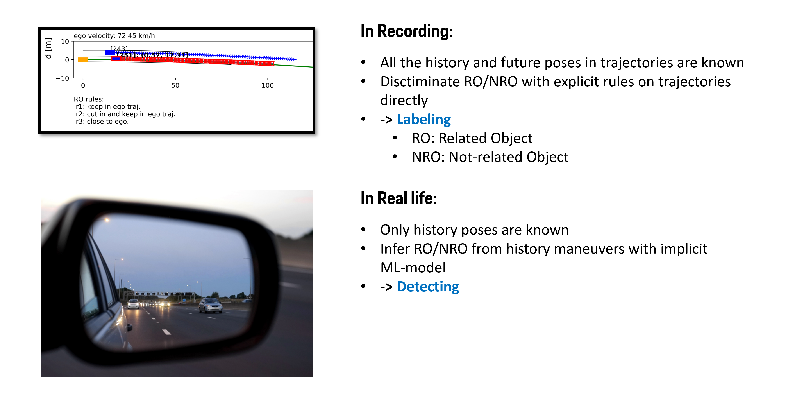
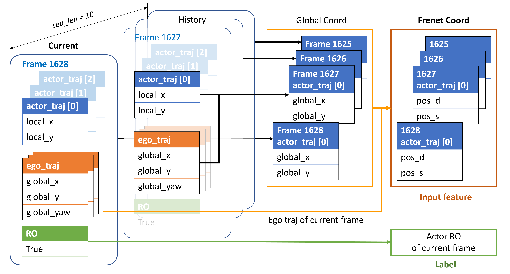

# Object Of Interest Detection

# Setup
## Environment setup
- cd to the root folder (where this README exists), install the package in requirements.txt
    ```bash
    pip install -r requirements.txt
    ```
- create folder `/mat_data` in root path (as defined in default args), paste ONE `.mat` recording in it.

    > Place ONLY ONE `.mat` recording in the `/data` folder every time.

    <details>
    <summary>convert .dat recordings to .mat</summary>

    - use Cisco to connect remote discs (Intranet)  
    visit the remote disk `M:\ADA\Highway-Pilot-Supervisor\ADTF_Recording`, select a `.dat` file in it.
    - visit the gitlab repo [group-mdm-tools](https://cicd.skyway.porsche.com/hwpt/group-mdm-tools), clone to local machine.  
    - check [README](https://cicd.skyway.porsche.com/hwpt/group-mdm-tools/-/blob/development/dat-reader-tool/readme.md) in `\group-mdm-tools\dat-reader-tool\`, line 14:  
      run this command at the path `\group-mdm-tools\dat-reader-tool\` (for every dat file you need to export):
      ```
      java -jar dat-reader-tool-assembly-0.0.1.jar <path_to_dat_file>  <path_to_fibex_file> <output_path> <delete_processed_data_flag>
      ```
      - path_to_dat_file accepts both a final path to a dat file, or a directory containing multiple dat files. 
      - path to fibex file needs to point to a file like : `MLBevo_Gen2_Fx_Cluster_KMatrix_V8.15.10F_20180208_SEn.xml`
      - output_path is not mandatory - if not provided, the output path is considered to be the current working directory
                          - if it's provided as "None" keyword, then the mat files will be saved in the same folder with the dat file
     
      example on my machine:
      ```
      java -jar dat-reader-tool-assembly-0.0.1.jar D:\Records\dat\20210609_123753_BB_split_000.dat MLBevo_Gen2_Fx_Cluster_KMatrix_V8.15.10F_20180208_SEn.xml D:\Records\mat
      ```

    </details>

    <br>

## Create folders
in root path
- `/labels`:  
  receive the generated `.json` label data.
- `/cache_display`:  
  receive the generated `.pkl` display data.
- `/snapshots`:  
  receive the `.png` display snapshots.
- `/cache_dataset`:  
  receive the `.pkl` dataset processed by json_loader.
- `/saved_models/tf`:  
  receive the `.h5` MLP models.
- `/debug`:  
  contains misc/temp files for debug


# Run

## `run.py` -- [in dev]
stay in root path, run the script `main.py`
  ```bash
  python run.py
  ```

This script contains the whole workflow: Dataset generating, Training and Display.
> ### optional args
> - `--skip_dataset_gen`: workflow control. Default= `False`
>   - False: Labeling tool would be executed. Generated are .json label file and .pkl display file.
>   - True: Labeling would be skipped. The .json label file and .pkl display file would be loaded by the given `record_name`
> - `--record_name`: if skip dataset generating, record_name **MUST** be given
> - `--skip_model_training`: workflow control. Default= `False`
>   - False: Training would be exexuted. Generated is a .h5 model.
>   - True: Traininfg would be skipped. The .h5 model would be loaded by the given `model_path`
> - `--model_path`: if skip model training, model_path **MUST** be given
> - `--mat_folder`: redirect the data path, where `.mat` recordings to be loaded.
> - `--label_folder`: redirect the label path, where `.json` results to be saved.
> - `--display_folder`: redirect output path display data.
> - `--range`: the length of the ego trajectory in the future to be the reference in coordinate transformation, it should cover the actor trajectory
> - `--sample_rate`: downsample the actor trajectory, for test it may be set to a larger number to speed up the process
> - `--gen_start_frame`: Default = 0. The start frame of the recording when generating dataset
> - `--is_dataset_from_pkl`: Default = False. save/load data of json_loader as .pkl file
> - `--load_start_frame`: the start frame for display


<br>
<br>

To debug/test one single module:

## `labeling.py`
- Load `.mat` recording via **MatLoader()** in `mat_loader.py`
- Discriminate actors according RO-rules, generate label data and display data
  - label data saved as `.json` file in `/labels` folder
  - display data saved as `.pkl` file in `/cache_display` folder
- Data structure & Concept: [Pipeline concept - 1. Labeling](#1-labeling)

## `mlp_tf.py`
- Load `.json` label via **JsonLoader()** in `json_loader.py`
- Re-process data frames as **train_set** and **test_set**, feasible to MLP
  - Data structure & Concept: [Pipeline concept - 1. Process data for training](#2-process-data-for-training)
***
- mlp_mode = `"train"`: 
  - Train the MLP model with **train_set**
  - MLP model saved as `.h5` file in the folder `/saved_models/tf`
- mlp_mode = `"pred"`: 
  - Load `.h5` model, evaluate the model with **test_set**
  - predict samples in **x_test**, get pred result **pred_ls**
  - compare **pred_ls** with **y_test**
  - plot evaluation metrics in terminal

## `traj_plot.py`
- Display labeling result
  > **TODO:**  
  > display MLP prediction result, compare with ground truth of RO-rules

<div align="center">
  <br>  
  Display with matplotlib  
</div> 

- press `SPACE` to pause the plotting
- press `c` to capture a snapshot, save to /snapshots
- press `ESC` to exit

### Legend
| Marker | stands for ... |
| --- | --- |
| **Black line** | lane and road structure |
| **Green line** | Ego traj |
| **Orange box** | Ego car |
| **Blue box** | Actor vehicles & trajs detected from Camera (BV2) |
| **Cyan box** | Actor vehicles & trajs detected from Long-range Radar (LRR1) |
| **Red edge** | Actor, labeled as RO (ground truth) |
| **White 'x' on actor** | Actor, pred as NRO |
| **Red 'x' on actor** | Actor, pred as RO |
| **Circle** | Actor history poses |

<div align="left">
  <br>  
</div> 

***
<br>
<br>

# Pipeline Concept

## 0. Recording vs. Real Life
<div align="center">
  <br>  
  Labeling in recordings. Predicting in real life<br>
  <br>
</div> 

### Labeling:

In one recording, all the points of ego and actor trajectories are known. We can get thier trajectories in any slot within the whole time span. The ego and actors' states are paired according to their "global time". Taking the 0-th trajectory point's time stamp as the current time, the labeling tool discriminates actors as RO (Related Object) or NRO (Not-Related Object) basing on their maneuver in the following frames directly.  

### Training:


## 1. Labeling

<div align="center">
  <br>  
  How was the label data organized<br>
  <br>
</div>  

- The data structure of the .json label file:


```python
[   
    # data[0]: The origin ego EML pose of the recording
    { 
        "ego_recording_start": [
            3.3390000000000004,
            7.212,
            -1.8010315029275
        ]
    },
    # data[1:]: List of ACTOR-EGO pairs
    {   # ACTOR 0 & its corresponding EGO traj
        "RO": false,  # RO-Label for this pair

        "actor_traj": [ # points of ACTOR trajectory
            { # states of point 0 in ACTOR trajectory
                "time": 0.0, # rel. to actor[0]'s global time
                "id": 242.0,
                "type": 7.0,
                "ref_point": 6.0,
                "width": 2.0,
                "length": 5.0,
                "height": 1.5,
                "vel_x": 38.30303851718452,
                "vel_y": 3.612994544048159,
                "yaw": -6.309817113248073e-10,
                "pos_x": 117.108, # rel. to ego[0]'s pos
                "pos_y": -0.6645, # rel. to ego[0]'s pos
                "sensor": "camera",
                "global": 0.04,   # Global time stamp -> pairs the ACTOR and EGO trajs
                "pos_s": 116.22880609109846,
                "pos_d": 0.47164890690169525,
                "vel_s": 40.196145608552314,
                "vel_d": -1.2634057893602224
            },
            {
              # states of point 1 in ACTOR trajectory
            },
            ... # 100 ACTOR points in total
        ],# END ACTOR point list

        "ego_traj": [ # points of EGO trajectory
            { # states of point 0 in EGO trajectory
                "global": 0.04,
                "time": 0.0,    # rel. to ego[0]'s global time
                "pos_x": -0.0,  # rel. to ego[0]'s pos
                "pos_y": 0.0,   # rel. to ego[0]'s pos
                "yaw": 0.0,
                "curv": 0,
                "vel_t": 33.875,
                "acc_t": 0.08999999999999986,
                "distance": 0.0,
                "world_x": 3.0299999999999994,  # 'EML_PositionX'
                "world_y": 5.893000000000001,   # 'EML_PositionY'
                "world_yaw": -1.8017986337985   # 'EML_YawAngle' in [rad]
            },
            {
              # states of point 1 in EGO trajectory
            },
            ... # 300 EGO points in total
        ]# END EGO point list
    },# END Ego-Actor pair

    { # ACTOR 1 & its corresponding EGO traj
        "RO": false, # RO-Label for this pair
        "actor_traj":
        [ # 100 actor points
            { actor state 0 },
              ...
            { actor state 99 },
        ],
        "ego_traj":
        [ # 300 ego points
            { ego state 0 },
            ...
            { ego state 299 },
        ]
    },
    
    ... # other actor-ego pairs
 
    { # ACTOR 11216 & its corresponding EGO traj
        "RO": false, # RO-Label for this pair
        "actor_traj": []
        "ego_traj": []
    },
]

```

## 2. Process data for training

- The 0 th point of trajectory (`ego_traj[0]`, `actor_traj[0]`) stands for the object's current state at the corresponding frame time stamp

<div align="center">
    <br>  
    traj[0] contains the information about object's current state<br>
    <br>
</div>  

- To imitate what a driver would do in real life, i.e. discriminate whether the surrounding traffic (actor) would interefere ego trajectory and cause collision potentially basing on the observation in the previous seconds.

<div align="center">
    <br>  
    Extract actor's history sequence to feed to MLP <br>
    <br>
</div>  

- Details about coordination convertion:
<div align="center">
    <br>  
    Details about coordination convertion <br>
    <br>
</div>  

## 3. Training
- Feed input feature and label to MLP
<div align="center">
    <br>  
    Details about coordination convertion <br>
    <br>
</div>  