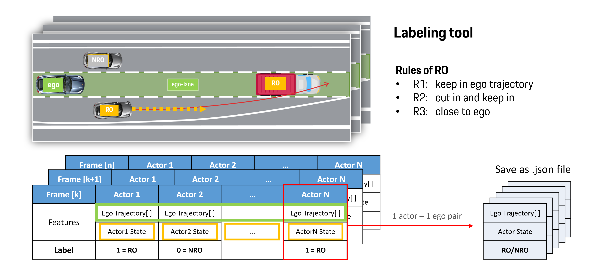

# Object Of Interest Detection

# Setup
- cd to the root folder (where this README exists), install the package in requirements.txt
    ```bash
    pip install -r requirements.txt
    ```
- create folder `/mat_data` in root path (as defined in default args), paste ONE `.mat` recording in it.

    > Place ONLY ONE `.mat` recording in the `/data` folder every time.

    <details>
    <summary>convert .dat recordings to .mat</summary>

    - use Cisco to connect remote discs (Intranet)  
    visit the remote disk `M:\ADA\Highway-Pilot-Supervisor\ADTF_Recording`, select a `.dat` file in it.
    - visit the gitlab repo [group-mdm-tools](https://cicd.skyway.porsche.com/hwpt/group-mdm-tools), clone to local machine.  
    - check [README](https://cicd.skyway.porsche.com/hwpt/group-mdm-tools/-/blob/development/dat-reader-tool/readme.md) in `\group-mdm-tools\dat-reader-tool\`, line 14:  
      run this command at the path `\group-mdm-tools\dat-reader-tool\` (for every dat file you need to export):
      ```
      java -jar dat-reader-tool-assembly-0.0.1.jar <path_to_dat_file>  <path_to_fibex_file> <output_path> <delete_processed_data_flag>
      ```
      - path_to_dat_file accepts both a final path to a dat file, or a directory containing multiple dat files. 
      - path to fibex file needs to point to a file like : `MLBevo_Gen2_Fx_Cluster_KMatrix_V8.15.10F_20180208_SEn.xml`
      - output_path is not mandatory - if not provided, the output path is considered to be the current working directory
                          - if it's provided as "None" keyword, then the mat files will be saved in the same folder with the dat file
     
      example on my machine:
      ```
      java -jar dat-reader-tool-assembly-0.0.1.jar D:\Records\dat\20210609_123753_BB_split_000.dat MLBevo_Gen2_Fx_Cluster_KMatrix_V8.15.10F_20180208_SEn.xml D:\Records\mat
      ```

    </details>

    <br>

- create folder `/labels` in root path, prepare to receive the generated `.json` label data.
- create folder `/cache_display` in root path, prepare to receive the generated `.pkl` display data.
- create folder `/snapshots` in root path, prepare to receive the `.png` display snapshots.
- create folder `/cache_dataset` in root path, prepare to receive the `.pkl` pre-processed datasets.
- create folder `/saved_models/tf` in root path, prepare to receive the `.h5` MLP models.


# Run
## `labeling.py`
- Load `.mat` recording via **MatLoader()** in `mat_loader.py`
- Discriminate actors according RO-rules, generate label data and display data
  - label data saved as `.json` file in `/labels` folder
  - display data saved as `.pkl` file in `/cache_display` folder
- Data structure & Concept: [Pipeline concept - 1. Labeling](#1-labeling)

## `mlp_tf.py`
- Load `.json` label via **JsonLoader()** in `json_loader.py`
- Re-process data frames as **train_set** and **test_set**, feasible to MLP
  - Data structure & Concept: [Pipeline concept - 1. Process data for training](#2-process-data-for-training)
***
- mlp_mode = `"train"`: 
  - Train the MLP model with **train_set**
  - MLP model saved as `.h5` file in the folder `/saved_models/tf`
- mlp_mode = `"pred"`: 
  - Load `.h5` model, evaluate the model with **test_set**
  - predict samples in **x_test**, get pred result **pred_ls**
  - compare **pred_ls** with **y_test**
  - plot evaluation metrics in terminal

## `traj_plot.py`
- Display labeling result
  > **TODO:**  
  > display MLP prediction result, compare with ground truth of RO-rules

<div align="center">
  <br>  
  Display with matplotlib  
</div> 

- press `SPACE` to pause the plotting
- press `c` to capture a snapshot, save to /snapshots
- press `ESC` to exit

### Legend
| Marker | stands for ... |
| --- | --- |
| **Orange rect** | Ego car |
| **Green line** | Ego traj |
| **Black line** | lane and road structure |
| **Red** | RO and RO traj |
| **Blue** | Actor vehicles & trajs detected from Camera (BV2) |
| **Pink** | Actor vehicles & trajs detected from Long-range Radar (LRR1) |

***
<br>
<br>

## `main.py` -- [in dev]
stay in root path, run the script `main.py`
  ```bash
  python main.py
  ```
> ### optional args
> - `--data_folder`: redirect the data path, where `.mat` recordings to be loaded.
> - `--logs_folder`: redirect the label path, where `.json` results to be saved.
> - `--range`: the length of the ego trajectory in the future to be the reference in coordinate transformation, it should cover the actor trajectory
> - `--sample_rate`: downsample the actor trajectory, for test it may be set to a larger number to speed up the process
> - `--load_pkl`: bool, decide if save/load the preprocessed data as/from .pkl file


<br>
<br>

# Pipeline Concept

## 0. Recording vs. Real Life
<div align="center">
  <br>  
  Labeling in recordings. Predicting in real life<br>
  <br>
</div> 

## 1. Labeling

<div align="center">
  <br>  
  How was the label data organized<br>
  <br>
</div>  

- The data structure of the .json label file:
```json
[ // a list of actor-ego pairs
    { // actor 0 & corresponding ego traj
        "RO": false,
        "actor_traj": [ // actor trajectory
            // actor state 0 in this trajectory
            {
                "time": 0.0,
                "id": 242.0,
                "type": 7.0,
                "ref_point": 6.0,
                "width": 2.0,
                "length": 5.0,
                "height": 1.5,
                "vel_x": 38.30303851718452,
                "vel_y": 3.612994544048159,
                "yaw": -6.309817113248073e-10,
                "pos_x": 117.108,
                "pos_y": -0.6645,
                "sensor": "camera",
                "global": 0.04,  // -> global time matches the actor and ego trajs of the same frame
                "pos_s": 116.22880609109846,
                "pos_d": 0.47164890690169525,
                "vel_s": 40.10415997182761,
                "vel_d": 0.9844861408616179
            },
            // actor state 1 in this trajectory
            {
                // ... 
            },
            // ... other actor states
            // 100 actor points in total
        ],
        "ego_traj": [ // corresponding ego trajectory
            // ego traj point 0
            {
                "global": 0.04,
                "time": 0.0,
                "pos_x": -0.0,
                "pos_y": 0.0,
                "yaw": 0.0,
                "curv": 0,
                "vel_t": 33.875,
                "acc_t": 0.08999999999999986,
                "distance": 0.0,
                "world_x": 3.0299999999999994, // 'EML_PositionX'
                "world_y": 5.893000000000001,  // 'EML_PositionY'
                "world_yaw": -1.8017986337985  // 'EML_YawAngle' in [rad]
            },
            // ego traj point 1
            {
                // ... 
            },
            // ... other ego traj points
            // 300 ego points in total
        ]
    },
    // actor 1 & corresponding ego traj
    {
        "RO": true,
        "actor_traj":[
            //... list of actor traj states
        ],
        "ego_traj":[
            //... list of ego traj points
        ]
    },
    // ... other actor-ego pairs
]
```

## 2. Process data for training

- The 0 th point of trajectory (`ego_traj[0]`, `actor_traj[0]`) stands for the object's current state at the corresponding frame time stamp

<div align="center">
    <br>  
    traj[0] contains the information about object's current state<br>
    <br>
</div>  

- To imitate what a driver would do in real life, i.e. discriminate whether the surrounding traffic (actor) would interefere ego trajectory and cause collision potentially basing on the observation in the previous seconds.

<div align="center">
    <br>  
    Extract actor's history sequence to feed to MLP <br>
    <br>
</div>  

- Details about coordination convertion:
<div align="center">
    <br>  
    Details about coordination convertion <br>
    <br>
</div>  

## 3. Training
- Feed input feature and label to MLP
<div align="center">
    <br>  
    Details about coordination convertion <br>
    <br>
</div>  